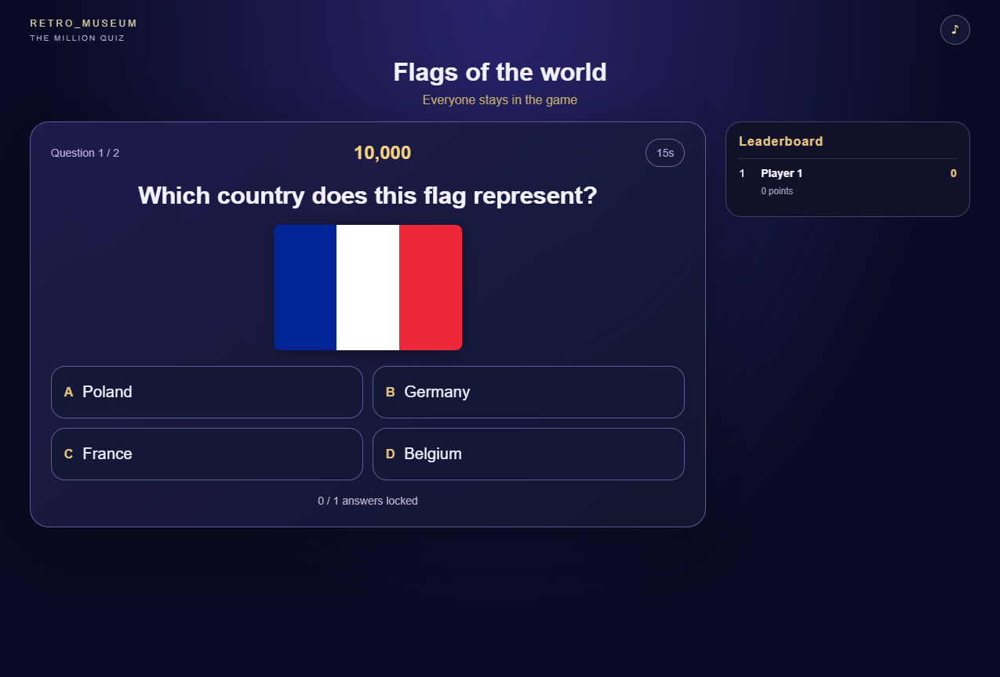
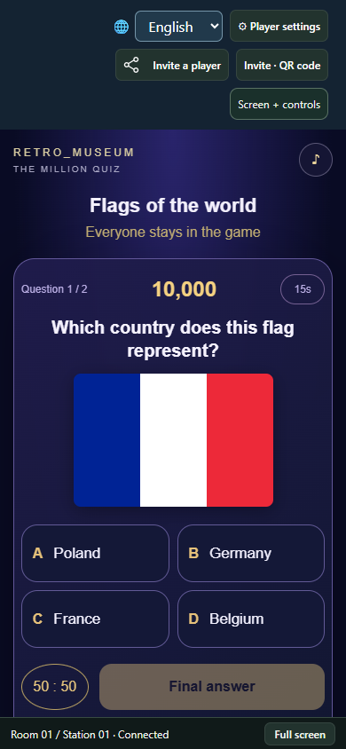

# The Million Quiz

One reusable Retro Museum activity, with separate questionnaires. Play on a shared screen using phones, alone or with a class. English, French and Tagalog UI and four 10-question starter packs: world flags, fruit, capitals, and European kings/queens.

## Play

Node 22+, `npm ci --ignore-scripts`, then `npm start`. Open the printed host URL. Choose questionnaire, game mode, 1–100 questions (within the selected pack), 15–90 seconds per answer, and authored or random question order. Phones join by QR; the host supports combined screen/controller mode.

- Ranking: everyone keeps playing; correct answers earn points, with equal weighting and tied results.
- Elimination: incorrect/missing answers end the prize run; every five correct stages secures a checkpoint. Eliminated players continue practicing.
- Cooperative: a unique most-voted answer decides the team's prize progress; tied/empty votes fail that stage. Individuals vote privately until reveal.
- One 50:50 lifeline per player. Answers lock on confirmation. All questions use server time; disconnects do not pause the class. Museum arrivals participate from the next question; standard standalone arrivals spectate until replay.

Gains are fictional points, with no money or purchases. The game declares no fixed player maximum: the host defaults to a 128-participant resource guard, configurable by the operator. This is not a claim of measured Wi-Fi capacity.

## Ask ChatGPT to contribute a quiz

Copy [the submission prompt](public/submit-prompt.txt), append your content instructions, and give it to an assistant. An HTTP-capable assistant can POST to `https://retro-museum.net/api/quizzes/submissions`. Otherwise it produces a JSON file for the [submission page](https://retro-museum.net/quizzes). No GitHub repository, game build or API key is required from a questionnaire author.

The payload is `{quiz, publication}`. A quiz has `schemaVersion:1`, an ID/title/author/language and 1–100 questions. Each question has prompt, four distinct answers, zero-based correct index, optional explanation and optional PNG/JPEG data URL (maximum 100,000 decoded bytes; dimensions up to 2048). Publication metadata describes rights, age, image provenance and sources. AI/content review is mandatory for the public catalog; receipt is not approval. The museum operator can import a private questionnaire into the local administration for offline use.

Only data is accepted, never user code. Public/private game snapshots expose no correct answer before reveal or another player's answer. Saved matches retain their selected question order, timer, choices, lifeline and points. Question data is reconstructed from the exact pinned questionnaire package on standalone restart.

## Development

`npm run build` creates the sandboxed engine/view and submission-page client. `npm test` covers content limits, private answers, stale/duplicate commands, save/restore, all modes, 128 simulated engine participants, and a 100-question match. `node node_modules/@manaty/retro-museum-sdk/validate.js .` performs the SDK compatibility check. These are not substitutes for physical network endurance tests.

Code: MIT. The original bundled questionnaire text and generated flag diagrams are supplied by Manaty under CC BY 4.0. Submitted quizzes retain their declared attribution; code packages include the base engine license and questionnaire attribution.

## Screenshots

Shared display:

Phone controller:

